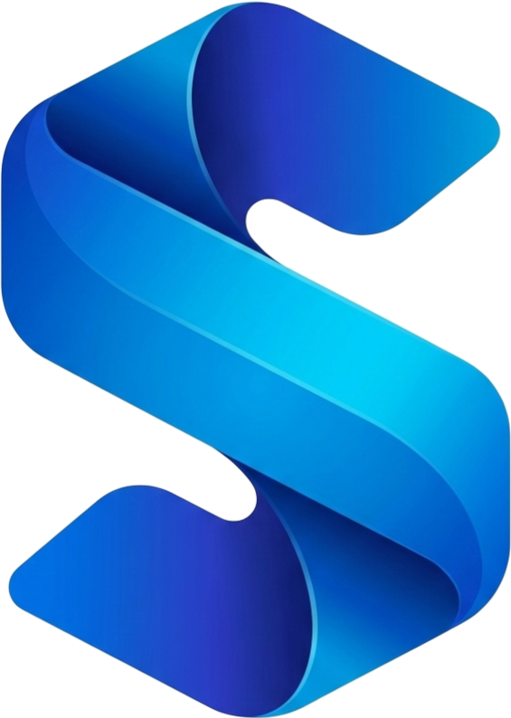

<p align="center">
    
    <h1 align="center">ScanHub</h1>
</p>

<p align="center">
    <a href="https://github.com/brain-link/scanhub/actions/workflows/build.yml" target="_blank">
        
    </a>
    <a href="https://github.com/brain-link/scanhub/actions/workflows/static-tests-backend.yml" target="_blank">
        
    </a>
    <a href="https://scanhub.brain-link.de/" target="_blank">
        
    </a>
</p>


# About

ScanHub is intended to be a multimodal acquisition software, which allows individualizable, modular and cloud-based processing of functional and anatomical medical images. 
It seamlessly merges the acquisition with the processing of complex data on a single platform.
ScanHub is open-source and freely available to anyone :earth_africa:.

The greatest novelty of ScanHub is the cross-manufacturer and multi-modality aspect, allowing accessible cloud-based data processing in one framework :rocket:.

Currently we are focusing on the development of an acquisition solution for the open-source MRI [OSI2One](https://www.opensourceimaging.org/2023/01/09/first-open-source-mri-scanner-presented-the-osii-one/).

ScanHub is designed as a client-server application. It consists of several services that form the backbone of the acquisition platform and a web-based frontend called scanhub-ui. (The [scanhub-ui](https://github.com/brain-link/scanhub-ui) repository was incorporated into the subfolder scanhub-ui of this repository to facilitate the joint development).


## Demo :clapper:

The following video shows a short demonstration of the ScanHub UI (September 2023). You will see how to navigate through the acquisition planner, inspect an MRI sequence and start an MRI simulation on a virtual MRI scanner. In the end we are demonstrating how to view the DICOM image, reconstructed by our workflow engine subsequently to the acquisition.

https://github.com/user-attachments/assets/da900b3b-e9b3-45bf-a6bb-85f69f3d5f73


## About

The advent of cloud computing has enabled a new era of innovation, and ScanHub is at the forefront of leveraging this technology for the benefit of the MRI community. By shifting image reconstruction, processing, and storage from on-site infrastructure to the cloud, ScanHub offers a myriad of advantages over traditional MRI consoles:
1.	Open-source transparency: ScanHub's open-source nature fosters transparency and collaboration within the MRI community, encouraging the development of a unified standard and preventing the fragmentation caused by proprietary black-box solutions. This approach enables researchers and developers to build upon each other's work, accelerating innovation and improving the overall quality of MRI solutions.
2.	Cost-efficiency: ScanHub eliminates the need for expensive on-site hardware and software, reducing both upfront investments and ongoing maintenance costs. This allows institutions of all sizes to access advanced MRI processing capabilities without breaking the budget.
3.	Scalability and flexibility: The cloud-based nature of ScanHub enables seamless scaling of resources as needed, allowing users to easily accommodate fluctuations in demand or expand their capabilities. Furthermore, ScanHub's platform-agnostic design allows for the integration of custom processing algorithms and third-party solutions, promoting innovation and avoiding vendor lock-in.
4.	Efficient resource utilization: ScanHub's centralized resource management ensures optimal allocation and utilization of resources across multiple projects and users, preventing bottlenecks and maximizing efficiency.
5.	Enhanced collaboration and data sharing: ScanHub's cloud-based infrastructure facilitates easy data sharing and collaboration among teams and institutions, enabling researchers to pool resources and insights to accelerate the development of new diagnostic techniques and treatments.
6.	Security and compliance: ScanHub's cloud platform adheres to stringent data security protocols and compliance requirements, ensuring that sensitive patient data remains protected and confidential.


## Setting up the Demo

<!-- start demo-setup -->

ScanHub is deployed using Docker and Docker Compose. Make sure they are installed. The following instructions will guide you through the process of an all-in-one deployment of ScanHub, i.e. all the services and the device connector will run on the same device.

### 1. Building ScanHub

The microservices within ScanHub are all built on the same base image, to ensure that critical dependencies match and identical data models are used.

Note that the `.github/workflows/deploy-containers.yml` workflow deploys the latest scanhub-base image from the main branch to the GitHub Container Registry (GHCR). By default, this image is used when building ScanHub with Docker Compose.

The following steps build the scanhub-base image from the local code repository instead.

```
docker build -t scanhub-base -f services/base/Dockerfile .
```

To build ScanHub with the base image which was just created, use the following command.

Note: You don't need to run `docker compose build` separately if you want to use the default setup — `docker compose up -d` creates all the required images if they are not already available.

```
docker compose build --build-arg SCANHUB_BASE_IMAGE=scanhub-base:latest
```
Alternatively, you can use the default image `ghcr.io/brain-link/scanhub/scanhub-base:latest` by running

```
docker compose build
```

Note: The repository contains an `.env` file which allows you to change the default image.

### 2. Starting ScanHub

To start all the containers, run the docker compose command.

```
docker compose up -d
```

To access the user interface, open your browser and navigate to [localhost](https://localhost:8443). By default, ScanHub uses a self-signed HTTPS certificate, which will cause the browser to show a security warning. You may ignore this warning for localhost during development.
If you run ScanHub for the first time, you are asked to create the first user when visiting [localhost](https://localhost:8443).


### 3. Register the Demo Device

Devices communicating with ScanHub need to authenticate, which is done using a token-based approach.
1. Log in and navigate to the library.
2. Create a new device: enter a device name and description.
3. After clicking 'Create', you can download a credentials file for the new device.
4. Save the credentials file as `device_credentials.json` next to the example device in `device-sdk/example`.

### 4. Install and Run the Demo Device

The demo device is built on the ScanHub device SDK, located in `device-sdk`. Dependencies are managed with [uv](https://docs.astral.sh/uv/), which creates and manages the virtual environment for you, so no separate environment setup is required.

Navigate to `device-sdk` and install the device-sdk package together with its `example` dependency group.
```
cd device-sdk
uv sync --group example
```
Last but not least, run the example script.
```
uv run example/example_usage.py
```

The following terminal output is expected:

    Device ID: d5b8bacd-1f52-4aaf-a3af-c8ee4e5352ee
    INFO:WebSockerHandler:WebSocket connection established.
    INFO:DeviceStateMachine:[STATE] Transitioned to ONLINE
    INFO:DeviceClient:Device registration sent.
    Client started and waiting for commands from the server.
    Server Feedback: Device ONLINE acknowledged.
    Server Feedback: Device registered successfully

### 5. Setup a Demo Protocol

To perform an acquisition with the demo device, first a protocol needs to be set up in ScanHub. In the user interface, navigate to *Library* and click on *Create Sequence* to upload the provided test sequence available in the example folder. After setting name, description and type, you need to upload `device-sdk/example/test-sequence.seq` as the sequence and `device-sdk/example/header_test-sequence.xml` as the ISMRMRD header file. 

Once the sequence is uploaded, click on *Create Protocol* and fill in the form to create a demo protocol. Once the protocol is created, select it and click on *Create Task*. Thereby, a new acquisition task is created and assigned to the previously created protocol. Within the task creation form, you need to select the demo device created and the sequence created in the previous step. Calibration and field of view settings can be ignored for this demo.

### 6. Trigger the Demo Device

In the ScanHub UI, navigate to *Patients*, click on the "+" button and fill the form to create a new patient for the demo.
Open the patient by clicking the button to the left of the newly created patient.

Now, you should see the acquisition view for a patient within the ScanHub UI. Click the "+" button in the protocols section to create an instance from the protocol template we created in the previous step. 

Before starting the demo acquisition, make sure the demo device is online. This is indicated by a green circle in the right section of the navigation bar. 

Open the protocol, select the acquisition and click the play button to start the demo acquisition. You should see how the progress bar fills up. Once the acquisition is done, the ISMRMRD raw data file is uploaded and should appear in the drop down menu underneath the acquisition task. As soon as the raw data is uploaded, the workflow orchestration engine gets notified and automatically performs the image reconstruction using [MRpro](https://mrpro.rocks/). The reconstruction result is uploaded in DICOM format and can be selected from the file drop down menu underneath the task, as soon as it is available. 

> Found a bug or ran into an issue? We'd love to hear about it! Please [open an issue](https://github.com/brain-link/scanhub/issues/new) and we'll take a look.

<!-- end demo-setup -->


## Documentation

See our dedicated [Documentation](https://scanhub.brain-link.de/) web page to get insights into the structure of ScanHub, microservice APIs and more.


### State of development

This software is not yet ready for clinical use, it is work in progress.
However, the integration with a research MRI device was successful, and the scanner could be operated remotely.
