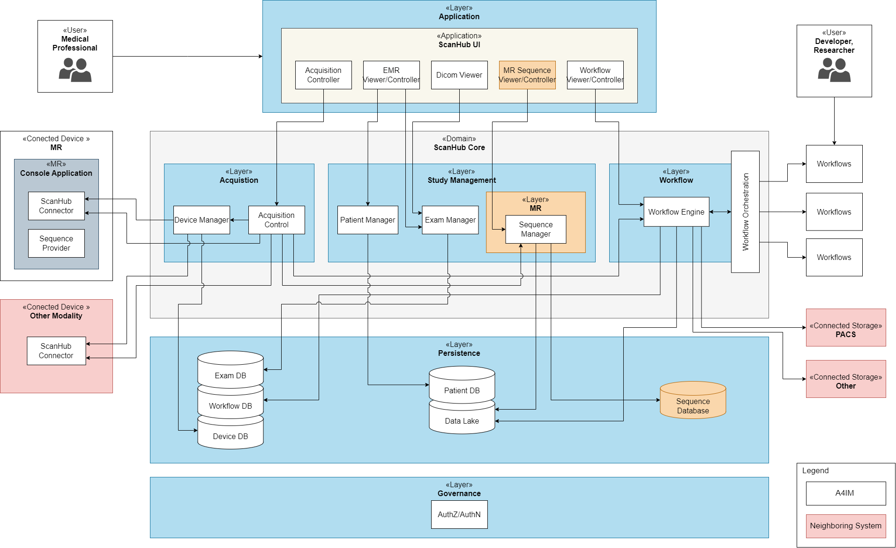
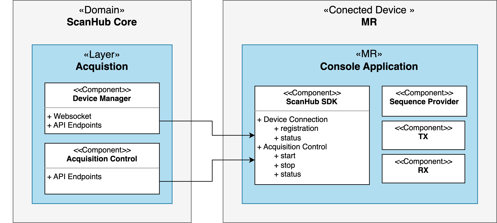
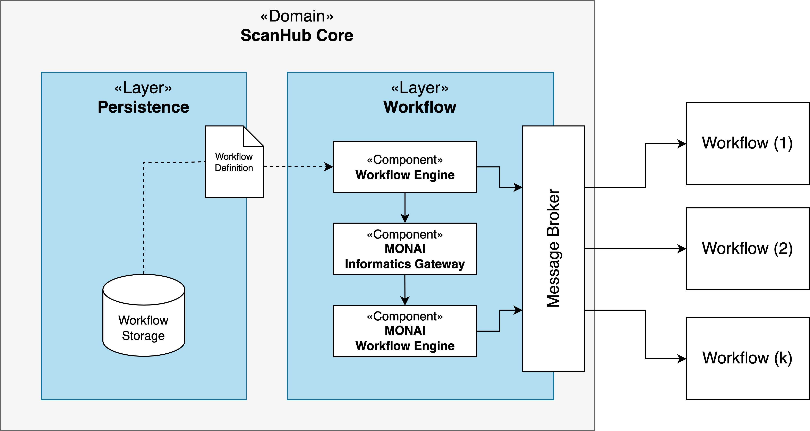

Software Architecture Design Description (SWAD)
###############################################

!!This Section is Work in Progress.!!

Introduction
============
Purpose
-------
This document delineates the comprehensive architectural design and technical realization of the ScanHub software system for MRI data acquisition and processing.
It aims to provide a coherent high-level perspective of the system's context, its static, and dynamic structures, serving as a pivotal reference for developers, programmers, regulatory affairs, and quality assurance teams.
The document is intended to facilitate the technical realization of the system, enabling developers to comprehend and develop it ideally without necessitating further inquiries or making adhoc design decisions.
It also offers future project members an expedited overview of the software system's structure and provides the test team with ample information on the assembly and testing of the software components during the integration tests. Where details surpass the scope of this document, readers are directed to lower-level architecture and design documents.

Scope
-----
The ScanHub system is a cloud-based, open-source data acquisition & processing platform specifically designed for transforming the way MRI data is processed, stored, and shared.
This document focuses on the architecture of the ScanHub Platform, detailing its integration with advanced simulation devices, efficient resource utilization, enhanced data sharing capabilities, and rigorous security measures, all leveraged through the power of cloud computing.
It translates the requirements provided by the Design Input [DI] and the Software Requirements Specification [SWRS] into the system architecture, serving as a comprehensive guide for the realization of the software components.
For additional details and specifications, refer to the design input documentation [DI, SWRS].

References
----------
- [DI] ScanHub Design Input
- [DD] ScanHub Device Description
- [SWRS] ScanHub Software Requirements Specification
- [SWDD] ScanHub Software Design Description
  
Definitions, Acronyms, and Abbreviations
----------------------------------------

Tables
------

Figures
-------

System Context
==============

Key Scenarios
-------------

System Decomposition
====================

  Figure 1: ScanHub Development View

+---------------+---------------------+-----------------------------------------------------------+--------------+ 
| ID            | Component           | Description                                               | Safety Class | 
+===============+=====================+===========================================================+==============+ 
| SWAD_CMP_0001 | Device Manager      | Manages connected devices, before and during acquisition. | A            | 
+---------------+---------------------+-----------------------------------------------------------+--------------+ 
| SWAD_CMP_0002 | Acquisition Control |                                                           |              | 
+---------------+---------------------+-----------------------------------------------------------+--------------+ 
| SWAD_CMP_0003 | Workflow Engine     |                                                           |              |
+---------------+---------------------+-----------------------------------------------------------+--------------+

    Figure 2: ScanHub Connected Device Component

    Figure 3: ScanHub Workflow Component